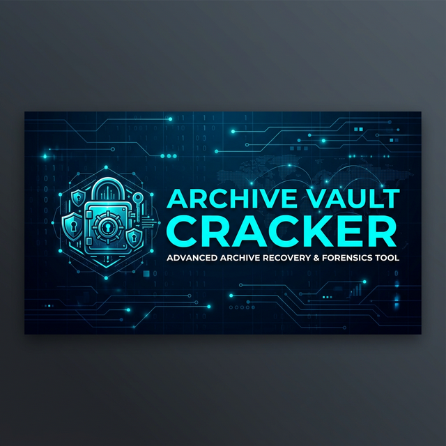

# 🔐 Archive Vault Cracker

  
  

A professional, high-performance cloud solution for recovering forgotten passwords of ZIP and RAR archives. Leverage the massive processing power of Google Colab's infrastructure to crack encrypted archives in minutes.

## 🚀 Key Features
- **Cloud Computing:** No local CPU usage. Runs entirely on Google Colab's high-speed servers.
- **Dual Engine Support:** 
    - **fcrackzip:** Ultra-fast recovery for ZIP files.
    - **John the Ripper:** Universal support for complex RAR/ZIP encryption.
- **Smart Wordlists:** Integrated with the legendary `rockyou.txt` dictionary or use your own custom wordlist URL.
- **User-Friendly Interface:** Professional Colab Forms that hide complex code, making it accessible for everyone.

## 🛠️ How to Use
1. **Open the Notebook:** Click the "Run on Google Colab" button above.
2. **Environment Setup:** Run the first cell to install `fcrackzip` and `john`.
3. **Configure Settings:**
    - Paste the **Archive Path** (Direct Link or Local Path).
    - Choose your **Recovery Method**.
    - Select your **Wordlist**.
4. **Initiate Recovery:** Click the Play button and wait for the results!

## 📸 Preview
*Include screenshots here to showcase the professional form interface.*

## ⚡ Technical Optimization
The tool automatically optimizes the Deno runtime (where applicable) and utilizes multi-threading capabilities provided by the backend environment to ensure maximum brute-force speed.

## 🤝 Lets Connect

✨ **Developed by Lakshan** ✨  

  <i>Specializing in Cloud Tooling & Cyber-Security Solutions</i>

---

   &nbsp;
  

---
> [!IMPORTANT]
> This tool is intended for educational purposes and for recovering your own forgotten passwords only. Using this tool for unauthorized access is strictly prohibited.
